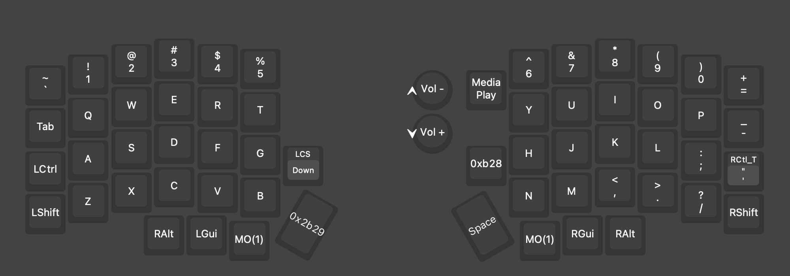
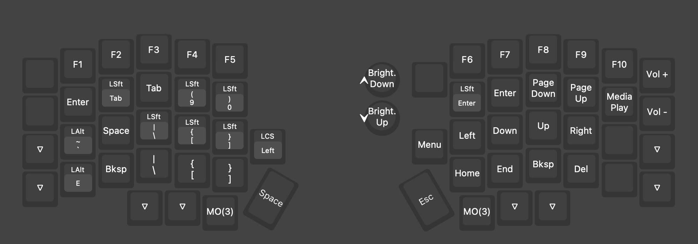
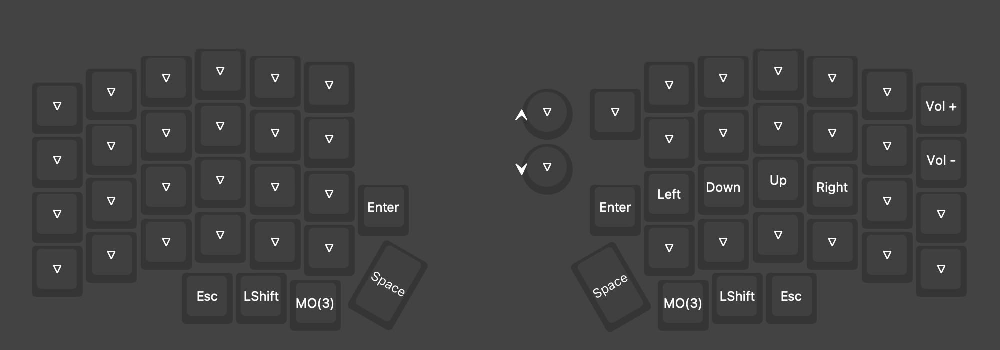
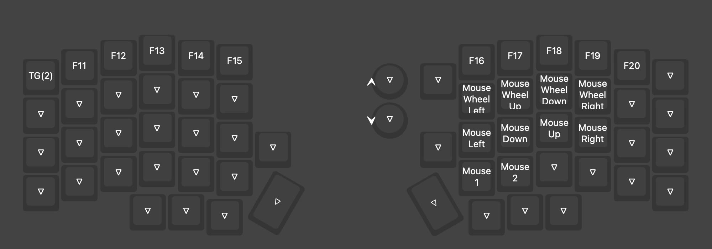

# lotus58-lily58-keymaps

I was inspired by people's setups online, so I'm also sharing mine!

I have two split keyboards, one at home (Lotus58) and one at the office (Lily58), but the layout on the two is identical. The only difference is that my lily58 doesn't support moving the mouse cursor.

#### Layer 0

#### Layer 1 - symbols and movement

#### Layer 2 - arrow keys for gaming

#### Layer 3 - F13-F20 and mouse

## Special key definitions:

| Label | Hold action | Tap action | Vial code |
|-------|-------------|------------|-----------|
| **`0x2b29`** | `Hyper` (⌃⇧⌘) | `Esc` | `MT(MOD_LCTL \| MOD_LSFT \| MOD_LGUI, KC_ESCAPE)` |
| **`0xb28`** | — | `Hyper + Enter` (Alfred “Universal File Action”) | `C(S(G(KC_ENTER)))` |

## Walkthrough and choices

Take a look at the layers, then check this list.

- **Thumb modifiers**: I tried to have them symmetrical, but I needed to have more keys, and also I observed I never used the left Space key, so I abandoned the idea.
    - The main thumb key is `Esc/Hyper` on the left and `Space` on the right (Space is also my leader key in neovim)).
    - I use the additional middle key of lotus58-lily58 for special OS functions (see below).
- **Special keys**:
    - The **left** special key is for shortcuts easily accessible only with a macos trackpad:
        - on **layer 0** it shows the desktop
        - on **layer 1** it shows the notification panel
    - The **right** special key is for file actions:
        - on **layer 0** it triggers Alfred File Action, so that I can open with, copy path, etc
        - on **layer 1** it triggers the macos 'menu' key, like a right click on a file in Finder
- **Layer 1** movement:
    - `hjkl` as vim
    - `page up` and `page down` are similar to `ctrl+i` and `ctrl+o` of vim. `O` is back, so it's `page down`.
    - `home` and `end` are in two available spots, after setting the rest, so `N` and `M`.
- **Layer 1** symbols:
    - I haven't moved the symbols in the number row, except for the round brackets and `+-`
    - **brackets** are all in the `RTFGVB` cluster
    - Moved `=+` to the left, near `0)`, while `-_` is below it, so they are closer to the home, while being near the original position
    - `|` is under `D` and `\` is under `C`
    - the special char under `S` and `X` allow me to do accended characters for writing in italian with the `ABC - Extended` layout (I no longer use [USA Plus](https://github.com/diegobit/usa-plus))
- **Layer 1** normal keys and repetitions:
    - `Enter` is under `U` and `Shift+Enter` is right to the left, under `Y`. This is useful for writing a newline without using the real `Shift`
    - `Tab` in the pinky is not handy, so I use it under `E`, while `W` triggers `Shift+Tab` to go back
    - `Backspace` and `Delete` are close, under `<` and `>`
    - `Space`, `Backspace` and `Enter` are repeated in the left half to use it with one hand, sometimes useful in games
    - `Space` and `Esc` are swapped in the thumb cluster for one hand usage.
- **Other** things:
    - `Ctrl` is repeated also on the right, useful in vim.
    - There are two `RAlt` because I use the `LAlt` for special characters from the `ABC - Extended` layout, and the RAlt is the key for doing other things, eg. it's the `Alt` used by [RCMD](https://lowtechguys.com/rcmd/) app.
- **layer 3** is triggered by holding the two layer keys together and is used:
    - mainly for `F13` onward
    - or moving the mouse cursor (Works only on my lotus58!) in rare cases
- **layer 2** is triggered from layer 2, clicking `\``; poor choice, I didn't know where to put it:
    - It's a `TG(2)`, so it keeps the layer 2 enabled, and I use it for the arrow keys in retrogaming.

## Keyboard models:

**lotus58**:

- Promicro RP2040
- Encoder knob
- TRRS Cable connection
- recognized by Vial as 'Tweetys Wild Thinn tking Lotus 58 Glow (QMK)'

**lily58**:

- Sea Picro (USB-C, RP2040, 16MB)
- recognized by Vial as 'TODO'
